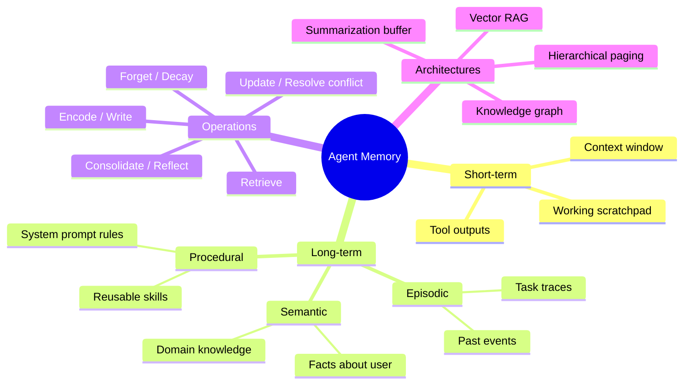
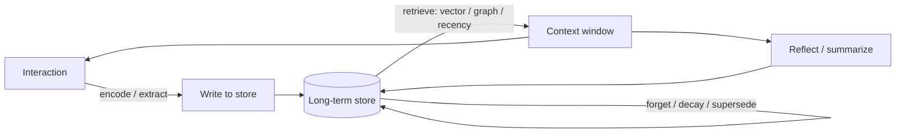

# Awesome Agentic Memory 

**The definitive, curated map of memory for LLM agents** — frameworks, research papers, benchmarks, taxonomy, and the deep dives that matter.

*How do you make an agent that actually remembers? This is everything worth reading, running, and benchmarking.*

---

> **Why memory?** An LLM's context window is its short-term memory — fast, fully attended, and gone the moment the window clears or overflows. Everything an agent should *remember across time* — facts about a user, past conversations, learned skills, evolving state — has to live **outside** the window and be selectively retrieved back in. That problem — what to store, when to retrieve it, how to update it, and how to forget — is **agentic memory**. This list maps the entire space.

## Contents

- [TL;DR — Start Here](#tldr--start-here)
- [Taxonomy of Agentic Memory](#taxonomy-of-agentic-memory)
  - [The CoALA frame](#the-coala-frame)
  - [Short-term vs long-term](#short-term-vs-long-term)
  - [Long-term subtypes](#long-term-subtypes-the-cognitive-science-mapping)
  - [Memory operations (the lifecycle)](#memory-operations-the-lifecycle)
  - [Memory architectures](#memory-architectures)
- [Open-Source Memory Frameworks](#open-source-memory-frameworks)
  - [Dedicated memory frameworks](#dedicated-memory-frameworks)
  - [Knowledge-graph & temporal memory](#knowledge-graph--temporal-memory)
  - [Framework-native memory](#framework-native-memory)
  - [Coding-agent & portable memory](#coding-agent--portable-memory)
- [Feature Comparison](#feature-comparison)
- [Managed / Commercial Memory Services](#managed--commercial-memory-services)
- [Research Papers](#research-papers)
  - [Surveys & foundational frameworks](#surveys--foundational-frameworks)
  - [Architectures](#architectures)
  - [Episodic & semantic memory](#episodic--semantic-memory)
  - [Memory management & lifelong learning](#memory-management--lifelong-learning)
- [Benchmarks & Evaluation](#benchmarks--evaluation)
  - [Memory-specific benchmarks](#memory-specific-benchmarks)
  - [Long-context benchmarks (related)](#long-context-benchmarks-related)
  - [Comparative evaluations & leaderboards](#comparative-evaluations--leaderboards)
- [Articles & Deep Dives](#articles--deep-dives)
- [Talks & Courses](#talks--courses)
- [Tutorials & Hands-On](#tutorials--hands-on)
- [Other Awesome Lists](#other-awesome-lists)
- [Contributing](#contributing)

---

## TL;DR — Start Here

New to the space? This is the shortest path to competence:

1. **Read** [Lilian Weng — LLM Powered Autonomous Agents](https://lilianweng.github.io/posts/2023-06-23-agent/) (the memory section) and the [CoALA paper](https://arxiv.org/abs/2309.02427) for vocabulary.
2. **Understand the two camps**: *hierarchical paging* ([MemGPT](https://arxiv.org/abs/2310.08560) → [Letta](https://github.com/letta-ai/letta)) vs *temporal knowledge graphs* ([Zep/Graphiti](https://github.com/getzep/graphiti)) vs *extraction pipelines* ([Mem0](https://github.com/mem0ai/mem0)).
3. **Run something**: [Mem0](https://github.com/mem0ai/mem0) (easiest drop-in) or [Letta](https://github.com/letta-ai/letta) (full stateful-agent platform).
4. **Benchmark it** against the field's standard trio: [LoCoMo](https://arxiv.org/abs/2402.17753) + [LongMemEval](https://arxiv.org/abs/2410.10813) + [BEAM](https://mem0.ai/blog/ai-memory-benchmarks-in-2026).

> ⚠️ **A note on benchmark scores throughout this list:** memory benchmark numbers are *heavily contested* — they swing wildly with config, judge model, and harness. See the [Zep ↔ Mem0 dispute](https://blog.getzep.com/lies-damn-lies-statistics-is-mem0-really-sota-in-agent-memory/) before trusting any single SOTA claim. Treat vendor-reported scores as vendor-reported.

---

## Taxonomy of Agentic Memory

### The CoALA frame

The accepted scaffolding comes from **[CoALA — Cognitive Architectures for Language Agents](https://arxiv.org/abs/2309.02427)** (Sumers, Yao, Narasimhan & Griffiths, 2023). It models any language agent as three parts: **memory**, an **action space** (internal reasoning + external tools), and a **decision procedure**. Its memory typology is lifted straight from human cognitive science (Tulving's episodic/semantic split) — which is why Letta, Mem0, LangMem, and Zep all map their features back to the same words.

### Short-term vs long-term

| | Short-term / working memory | Long-term memory |
|---|---|---|
| **Where** | *Inside* the context window | *Outside* the window (vector / graph / SQL / files) |
| **Lifetime** | One reasoning episode; volatile | Persists across sessions; effectively unbounded |
| **OS analogy** ([MemGPT](https://arxiv.org/abs/2310.08560)) | RAM | Disk |
| **Constraint** | Finite token budget | Retrieval quality — agent only sees what gets pulled in |

The central engineering problem is **context management**: deciding which slice of a huge long-term store gets loaded into the small working set, and when. Letta and Anthropic both call this *context engineering*.

### Long-term subtypes (the cognitive-science mapping)

| Subtype | Human analog | In an agent | Stored as |
|---|---|---|---|
| **Episodic** | Memory of specific events | "What happened" — interactions, traces, outcomes | Event/episode summaries, past trajectories |
| **Semantic** | General world knowledge | "What is true" — user facts, preferences, entities | Vector-embedded facts, KG triples |
| **Procedural** | Skills / how-to | "How to act" — rules, workflows, skills | Editable system prompt, code, skill libraries |

A widely cited refinement (LangMem) is the **distillation hierarchy**: raw episodic experiences distill into semantic facts; repeated semantic patterns crystallize into procedural rules. Memory consolidates *upward*, specific → general, over time.

### Memory operations (the lifecycle)

- **Encoding / writing** — extract what's worth keeping (fact/entity extraction, salience scoring). Runs *hot-path* (synchronous, during the turn) or *background* (async — LangMem, ChatGPT's "dreaming").
- **Retrieval** — vector similarity, BM25/keyword, hybrid, graph traversal, recency. Generative Agents scores by **recency × relevance × importance**.
- **Forgetting / decay** — TTL/expiry, recency decay, relevance pruning. Keeps the store from growing unbounded.
- **Consolidation** — merge, dedup, abstract raw memories into higher-level ones (episodic → semantic).
- **Reflection / summarization** — synthesize higher-order insights ("reflections"); **compaction** = summarize-and-reinitialize a near-full window.
- **Updating / conflict resolution** — revise memories when facts change. Good systems mark old facts *superseded* rather than silently overwriting — this is where **temporal reasoning** matters (Zep's bi-temporal graph is the reference example).

### Memory architectures

| Architecture | How it works | Strength | Weakness | Reference impl |
|---|---|---|---|---|
| **Vector RAG** | Embed memories, retrieve by similarity | Simple, ubiquitous | Weak at structured/temporal reasoning & conflicts | Pinecone, Chroma, pgvector |
| **Knowledge / temporal graph** | Entities + relations as a graph; bi-temporal validity windows | Best for temporal reasoning & conflict resolution | More infra, extraction cost | [Graphiti / Zep](https://github.com/getzep/graphiti) |
| **Hierarchical paging (LLM-as-OS)** | Core (RAM) / recall (cache) / archival (cold) tiers; agent pages data in/out via tools | Illusion of unbounded context; agent self-manages | Latency of tool-call paging | [Letta / MemGPT](https://github.com/letta-ai/letta) |
| **Summarization buffer** | Rolling summary of old turns + verbatim recent window | Cheap, easy | Lossy | LangChain buffer memory |

Production systems usually **combine** these — e.g. Redis for session state, a vector DB for semantic recall, Postgres for episodic/procedural, a graph for relations.

---

## Open-Source Memory Frameworks

> ⭐ Star counts are rough order-of-magnitude as of June 2026 — they move fast.

### Dedicated memory frameworks

| Project | Stars | What it does | Approach | Lang | License |
|---|---|---|---|---|---|
| [Mem0](https://github.com/mem0ai/mem0) | ~59k | Universal memory layer for AI agents | Hybrid vector + graph + KV, auto extraction (user/session/agent scopes) | Python | Apache-2.0 |
| [Letta](https://github.com/letta-ai/letta) (ex-MemGPT) | ~23k | Platform for stateful, self-improving agents | Hierarchical OS-style paging (core / recall / archival), self-managed via tools | Python | Apache-2.0 |
| [Cognee](https://github.com/topoteretes/cognee) | ~18k | AI memory platform, persistent long-term memory | Hybrid graph + vector KG (ECL pipeline) | Python | Apache-2.0 |
| [Memori](https://github.com/MemoriLabs/Memori) | ~15k | Agent-native memory infra | Structured entity/event/fact extraction, LLM-agnostic | Py/TS/Rust | Apache-2.0 |
| [memU](https://github.com/NevaMind-AI/memU) | ~14k | Memory harness for proactive agents | Multimodal → typed MemoryItems, ~10× token reduction | Python | Apache-2.0 |
| [MemOS](https://github.com/MemTensor/MemOS) | ~10k | Self-evolving "memory OS" | Memory-OS abstraction, hybrid retrieval, cross-task skill reuse | TS/Python | Apache-2.0 |
| [Second-Me](https://github.com/mindverse/Second-Me) | ~10k+ | "AI-native memory 2.0" — train your AI self | Persistent personal identity model | Py/TS | Apache-2.0 |
| [Honcho](https://github.com/plastic-labs/honcho) | ~5k | Memory modeling people/groups over time | Reasoning-first peer representations, async background inference | Py/TS | AGPL-3.0 |
| [OpenMemory](https://github.com/CaviraOSS/OpenMemory) | ~4k | Local persistent memory for LLM apps | Local cognitive memory engine, MCP server | TS | Apache-2.0 |
| [MemMachine](https://github.com/MemMachine/MemMachine) | ~3k | Universal memory layer | Scalable, interoperable storage + retrieval | Python | Apache-2.0 |
| [Memobase](https://github.com/memodb-io/memobase) | ~3k | User-profile long-term memory for chatbots | Structured profiles + time-aware event timelines, <100ms | Py/Go/TS | Apache-2.0 |
| [ReMe](https://github.com/agentscope-ai/ReMe) (ex-MemoryScope) | ~3k | Memory kit for agents (Alibaba/AgentScope) | Extract / reuse / share memory across users & agents | Python | Apache-2.0 |
| [Memary](https://github.com/kingjulio8238/Memary) | ~3k | Memory layer for autonomous agents | Neo4j knowledge-graph + entity memory | Python | MIT |
| [LangMem](https://github.com/langchain-ai/langmem) | ~2k | Memory primitives so agents learn/adapt | Extraction + prompt refinement; semantic/procedural; any store | Python | MIT |
| [Redis Agent Memory Server](https://github.com/redis/agent-memory-server) | ~1k | Fast memory server on Redis | Short-term session + long-term vector, MCP server | Python | Apache-2.0 |
| [A-MEM](https://github.com/agiresearch/A-mem) | ~1k | Agentic memory (NeurIPS 2025) | Zettelkasten-style dynamic organization + linking | Python | MIT |
| [MemoryOS](https://github.com/BAI-LAB/MemoryOS) | research | Memory OS for personalized agents (EMNLP 2025 Oral) | Hierarchical Storage/Updating/Retrieval/Generation | Python | — |
| [Motorhead](https://github.com/getmetal/motorhead) | ~850 | Memory + IR server for LLMs | Session memory + incremental summarization | Rust | Apache-2.0 ⚠️ low activity |
| [HybridAGI](https://github.com/SynaLinks/HybridAGI) | small | Neuro-symbolic agent w/ graph memory | Graph + vector memory | Python | GPL-3.0 |
| [memonto](https://github.com/shihanwan/memonto) | small | Ontology-based memory management | Graph/ontology-driven | Python | — |

### Knowledge-graph & temporal memory

| Project | Stars | What it does | Approach | License |
|---|---|---|---|---|
| [Graphiti](https://github.com/getzep/graphiti) | ~28k | Build temporal knowledge graphs for agents | Bi-temporal KG (fact-validity windows, provenance) — powers Zep | Apache-2.0 |
| [Microsoft GraphRAG](https://github.com/microsoft/graphrag) | ~20k+ | Graph-based RAG / community summarization | Graph extraction + community summaries | MIT |
| [Zep](https://github.com/getzep/zep) | ~5k | Context-engineering platform on Graphiti | Temporal KG memory, sub-200ms context assembly | Apache-2.0 |
| [txtai](https://github.com/neuml/txtai) | ~13k | Embeddings DB for semantic search + LLM workflows | Vector + graph + SQL; RAG/memory backbone | Apache-2.0 |

### Framework-native memory

Memory modules built into the major agent frameworks — use these if you're already on the framework.

| Framework | Memory module | Approach | License |
|---|---|---|---|
| [LangChain / LangGraph](https://github.com/langchain-ai/langchain) | Buffer / summary / vector-store memory; LangGraph persistent store + checkpoints | Buffer/summary/vector + durable store | MIT |
| [LlamaIndex](https://github.com/run-llama/llama_index) | Chat memory buffers, vector memory, composable memory blocks | Vector + summary + composable | MIT |
| [Haystack](https://github.com/deepset-ai/haystack) | Conversation + document memory via stores | Store-backed memory | Apache-2.0 |
| [Semantic Kernel](https://github.com/microsoft/semantic-kernel) | Semantic memory plugins / connectors | Embedding/vector, pluggable connectors | MIT |
| [CrewAI](https://github.com/crewAIInc/crewAI) | Short/long-term + entity memory (Qdrant Edge) | Short + long + entity, hierarchical isolation | MIT |
| [AutoGen / AG2](https://github.com/microsoft/autogen) | Message history + teachable-agent memory | Conversation history + teachability | MIT |
| [OpenAI Agents SDK](https://github.com/openai/openai-agents-python) | Sessions for conversation state | Session-based memory | MIT |
| [Google ADK](https://github.com/google/adk-python) | Session state + MemoryService (pluggable backends) | Session state + memory service (e.g. Vertex RAG) | Apache-2.0 |
| [PraisonAI](https://github.com/MervinPraison/PraisonAI) | Graph + vector memory | Graph + vector | MIT |

### Coding-agent & portable memory

Persistent memory for coding assistants (Claude Code, Copilot, Cursor) and agent-agnostic memory runtimes.

| Project | Stars | What it does | Lang |
|---|---|---|---|
| [Supermemory](https://github.com/supermemoryai/supermemory) | ~27k | Fast/scalable memory + context engine, runs locally | TS |
| [EverOS](https://github.com/EverMind-AI/EverOS) | ~7k | Portable self-evolving memory across agents | Python |
| [agentmemory](https://github.com/rohitg00/agentmemory) | ~5k | Persistent memory for coding agents | TS/Python |
| [ByteRover / Cipher](https://github.com/campfirein/cipher) | ~5k | Portable memory layer for coding agents (MCP) | TS |
| [claude-mem](https://github.com/thedotmack/claude-mem) | mid | Cross-session context for coding agents | TS |
| [Engram](https://github.com/Gentleman-Programming/engram) | mid | Agent-agnostic persistent memory (Go, SQLite FTS5, MCP) | Go |
| [BaseAI](https://github.com/LangbaseInc/baseai) | mid | Serverless agent framework with vector memory primitive | TS |
| [mem-agent](https://huggingface.co/driaforall/mem-agent) | model | 4B model fine-tuned for memory ops over markdown files | weights |

---

## Feature Comparison

The dimensions that actually differentiate memory systems. Use these as your evaluation columns.

| System | Persistence | Backend | Temporal reasoning | Conflict resolution | Self-editing | Write timing | Deploy |
|---|---|---|---|---|---|---|---|
| **Mem0** | Cross-session | Vector + graph + KV | Timestamps | Dedup + merge | No | Hot-path | OSS + Cloud |
| **Letta** | Cross-session | Postgres + vector | Timestamps | Supersede (agent-managed) | ✅ Yes (tools) | Hot-path | OSS + Cloud |
| **Zep / Graphiti** | Cross-session | Bi-temporal graph | ✅ Bi-temporal | ✅ Supersede-with-history | No | Background | OSS + Cloud |
| **Cognee** | Cross-session | Graph + vector | Timestamps | Dedup | No | Pipeline | OSS |
| **LangMem** | Cross-session | Any (LangGraph store) | App-defined | App-defined | Partial | Hot + background | OSS + SDK |
| **MemOS / MemoryOS** | Cross-session | Hierarchical tiers | Timestamps | Segmented-page update | ✅ Yes | Hot + background | OSS |
| **Memobase** | Cross-session | Profile + timeline | ✅ Time-aware events | Profile merge | No | Background | OSS + Cloud |

*Key dimensions not shown but worth checking per project:* multi-user namespacing, forgetting/decay policy, retrieval method (vector vs hybrid vs graph), tokens-per-query cost, and which benchmarks each reports.

---

## Managed / Commercial Memory Services

| Service | What it is |
|---|---|
| [Mem0 Platform](https://mem0.ai/) | Managed memory layer (also OSS); large token-cost reduction claims; broad integrations + OpenMemory MCP server |
| [Zep Cloud](https://www.getzep.com/) | Managed temporal-KG memory for enterprise-scale agents |
| [Letta Cloud](https://www.letta.com/) | Managed MemGPT-style stateful agents (core/recall/archival) |
| [LangMem SDK](https://www.langchain.com/langmem) | Long-term memory over the LangGraph store (Postgres/MongoDB backends) |
| [ChatGPT Memory](https://help.openai.com/en/articles/8590148-memory-faq) | Consumer persistent memory — saved memories + chat history, background "dreaming" update |
| [Anthropic Memory Tool](https://www.anthropic.com/engineering/effective-context-engineering-for-ai-agents) | File-based memory tool on the Claude Developer Platform for cross-session state |

---

## Research Papers

> Grouped by category, newest-first within each group. arXiv IDs verified.

### Surveys & foundational frameworks

- **[CoALA: Cognitive Architectures for Language Agents](https://arxiv.org/abs/2309.02427)** — Sumers et al., 2023 — the canonical taxonomy (working / episodic / semantic / procedural); the standard vocabulary for the whole field.
- **[Graph-based Agent Memory: Taxonomy, Techniques, and Applications](https://arxiv.org/abs/2602.05665)** — Yang et al., 2026 — survey of graph-structured memory: extraction, storage, retrieval, evolution.
- **[From Human Memory to AI Memory: A Survey on Memory Mechanisms in the Era of LLMs](https://arxiv.org/abs/2504.15965)** — Wu et al., 2025 — maps human memory onto AI via an object/form/time taxonomy.
- **[A Survey on the Memory Mechanism of LLM-based Agents](https://arxiv.org/abs/2404.13501)** — Zhang et al., 2024 (TOIS 2025) — the canonical agent-memory survey ([repo](https://github.com/nuster1128/LLM_Agent_Memory_Survey)).
- **[The Rise and Potential of LLM Based Agents: A Survey](https://arxiv.org/abs/2309.07864)** — Xi et al., 2023 — broad agent survey; influential brain/perception/action memory framing.

### Architectures

- **[MemOS: Memory OS of AI Agent](https://arxiv.org/abs/2506.06326)** — Kang et al., 2025 (EMNLP Oral) — OS-inspired hierarchical memory with FIFO + segmented-page updates.
- **[MemEngine: A Unified Modular Library for LLM-Agent Memory](https://arxiv.org/abs/2505.02099)** — Zhang et al., 2025 (TheWebConf Oral) — modular library implementing many published memory models.
- **[Mem0: Building Production-Ready AI Agents with Scalable Long-Term Memory](https://arxiv.org/abs/2504.19413)** — Chhikara et al., 2025 — extract/consolidate/retrieve pipeline (+ graph variant); big latency/token savings.
- **[Zep: A Temporal Knowledge Graph Architecture for Agent Memory](https://arxiv.org/abs/2501.13956)** — Rasmussen et al., 2025 — temporal KG on Graphiti; beats MemGPT on DMR, improves LongMemEval.
- **[MemoRAG: Next-Gen RAG via Memory-Inspired Knowledge Discovery](https://arxiv.org/abs/2409.05591)** — Qian et al., 2024 — dual-system RAG: long-range memory LLM generates retrieval clues.
- **[Memory³: Language Modeling with Explicit Memory](https://arxiv.org/abs/2407.01178)** — Yang et al., 2024 — "explicit memory" as a third form beyond params and KV context.
- **[HMT: Hierarchical Memory Transformer](https://arxiv.org/abs/2405.06067)** — He et al., 2024 — plug-in hierarchical memory imitating human memorization.
- **[Larimar: LLMs with Episodic Memory Control](https://arxiv.org/abs/2403.11901)** — Das et al., 2024 — brain-inspired episodic memory; one-shot edits + selective forgetting.
- **[MemoryLLM: Towards Self-Updatable LLMs](https://arxiv.org/abs/2402.04624)** — Wang et al., 2024 (ICML) — fixed-size latent memory pool, self-updates over ~1M updates.
- **[MemGPT: Towards LLMs as Operating Systems](https://arxiv.org/abs/2310.08560)** — Packer et al., 2023 — the foundational "LLM as OS" paper; tiered memory + interrupts (now Letta).
- **[RecurrentGPT: Interactive Generation of (Arbitrarily) Long Text](https://arxiv.org/abs/2305.13304)** — Zhou et al., 2023 — language-based recurrence with NL long/short-term memory.
- **[RET-LLM: A General Read-Write Memory for LLMs](https://arxiv.org/abs/2305.14322)** — Modarressi et al., 2023 — knowledge as triplets; scalable, updatable, interpretable.
- **[SCM: Self-Controlled Memory Framework](https://arxiv.org/abs/2304.13343)** — Liang et al., 2023 — agent + memory stream + controller; infinite-length input, no fine-tuning.
- **[Memorizing Transformers](https://arxiv.org/abs/2203.08913)** — Wu et al., 2022 (ICLR) — non-differentiable kNN memory over past (k,v) pairs up to 262K tokens.
- **[Retrieval-Augmented Generation (RAG)](https://arxiv.org/abs/2005.11401)** — Lewis et al., 2020 (NeurIPS) — parametric + non-parametric memory; foundation of retrieval-based memory.

### Episodic & semantic memory

- **[MemInsight: Autonomous Memory Augmentation for LLM Agents](https://arxiv.org/abs/2503.21760)** — Salama et al. (Amazon), 2025 — autonomous annotation/retrieval; +34% recall over RAG on LoCoMo.
- **[A-MEM: Agentic Memory for LLM Agents](https://arxiv.org/abs/2502.12110)** — Xu et al., 2025 — Zettelkasten-inspired atomic notes, dynamic linking, memory evolution.
- **[From RAG to Memory: Non-Parametric Continual Learning (HippoRAG 2)](https://arxiv.org/abs/2502.14802)** — Gutiérrez et al., 2025 (ICML) — deeper passage integration; factual + associative memory gains.
- **[MemTree: Dynamic Tree Memory Representation](https://arxiv.org/abs/2410.14052)** — Rezazadeh et al., 2024 — tree-structured memory at varying abstraction, like cognitive schemas.
- **[HippoRAG: Neurobiologically Inspired Long-Term Memory](https://arxiv.org/abs/2405.14831)** — Gutiérrez et al., 2024 (NeurIPS) — hippocampal-index retrieval via KG + Personalized PageRank.
- **[MemoryBank: Enhancing LLMs with Long-Term Memory](https://arxiv.org/abs/2305.10250)** — Zhong et al., 2023 (AAAI) — Ebbinghaus-forgetting-curve updates; SiliconFriend companion.
- **[Generative Agents: Interactive Simulacra of Human Behavior](https://arxiv.org/abs/2304.03442)** — Park et al., 2023 (UIST) — memory stream + recency/importance/relevance retrieval + reflection.

### Memory management & lifelong learning

- **[Agent Workflow Memory (AWM)](https://arxiv.org/abs/2409.07429)** — Wang et al., 2024 (ICML 2025) — induces reusable workflows from past trajectories.
- **[Memory Sharing for LLM-based Agents](https://arxiv.org/abs/2404.09982)** — Gao & Zhang, 2024 — shared memory pool across similar agents; collective intelligence.
- **[Think-in-Memory (TiM)](https://arxiv.org/abs/2311.08719)** — Liu et al., 2023 — store evolving "thoughts" with insert/forget/merge + LSH retrieval.
- **[ExpeL: LLM Agents Are Experiential Learners](https://arxiv.org/abs/2308.10144)** — Zhao et al., 2023 (AAAI) — extract NL insights across tasks, recalled at inference.
- **[MemoChat: Memos for Consistent Long-Range Conversation](https://arxiv.org/abs/2308.08239)** — Lu et al., 2023 — memorize–retrieve–respond cycles with structured memos.
- **[RecallM: Adaptable Memory with Temporal Understanding](https://arxiv.org/abs/2307.02738)** — Kynoch et al., 2023 — graph-backed memory; 4× better at knowledge updates than vector-only.
- **[LongMem: Augmenting LMs with Long-Term Memory](https://arxiv.org/abs/2306.07174)** — Wang et al., 2023 (NeurIPS) — decoupled memory encoder + residual side-network reader.
- **[Voyager: An Open-Ended Embodied Agent](https://arxiv.org/abs/2305.16291)** — Wang et al., 2023 — lifelong Minecraft agent with a growing, retrievable skill library (code-as-memory).
- **[Reflexion: Language Agents with Verbal Reinforcement Learning](https://arxiv.org/abs/2303.11366)** — Shinn et al., 2023 (NeurIPS) — verbal self-reflections in an episodic buffer; no weight updates.

---

## Benchmarks & Evaluation

> ⚠️ Memory scores are config/judge/harness-dependent and frequently contested. Always note who reported a number.

### Memory-specific benchmarks

| Benchmark | Year | Measures | Size | Links |
|---|---|---|---|---|
| **LoCoMo** | 2024 | Very long conversational memory: single/multi-hop QA, temporal reasoning, event summarization, multimodal gen | 10 convos, ~300 turns, ~1.5K QA | [paper](https://arxiv.org/abs/2402.17753) · [site](https://snap-research.github.io/locomo/) · [data](https://github.com/snap-research/locomo) |
| **LongMemEval** | 2024 (ICLR 2025) | 5 abilities: extraction, multi-session, temporal, knowledge updates, abstention | 500 curated Qs, scalable history | [paper](https://arxiv.org/abs/2410.10813) · [site](https://xiaowu0162.github.io/long-mem-eval/) · [code](https://github.com/xiaowu0162/LongMemEval) |
| **BEAM** | 2025/26 | Memory at **1M–10M tokens**, 10 categories; unsolvable by bigger context | 1M & 10M scale | [explainer](https://mem0.ai/blog/what-is-beam-memory-benchmark-the-paper-that-shows-1m-context-window-isnt-enough) |
| **MemoryAgentBench** | 2025 (ICLR 2026) | Accurate Retrieval, Test-Time Learning, Long-Range Understanding, Conflict Resolution | inject-once/query-many | [paper](https://arxiv.org/abs/2507.05257) · [code](https://github.com/HUST-AI-HYZ/MemoryAgentBench) |
| **ConvoMem** | 2025 | Conversational memory + memory-vs-RAG crossover study | 75,336 QA pairs | [paper](https://arxiv.org/abs/2511.10523) |
| **MemBench** | 2025 (ACL Findings) | Factual vs reflective memory; participation vs observation | — | [paper](https://arxiv.org/abs/2506.21605) · [code](https://github.com/import-myself/Membench) |
| **DialSim** | 2024 | Real-time multi-party dialogue (TV shows), time-constrained, temporal-KG QA | ~350K tokens, ~1K Qs/session | [paper](https://arxiv.org/abs/2406.13144) · [site](https://dialsim.github.io/) |
| **PerLTQA** | 2024 | Personalized long-term QA: semantic + episodic (**Chinese**) | 8,593 Qs, 30 characters | [paper](https://arxiv.org/abs/2402.16288) |
| **MemGPT DMR** | 2023 | Deep Memory Retrieval — cross-session consistency (built on MSC) | derived from MSC | [paper](https://arxiv.org/abs/2310.08560) |
| **MSC (Multi-Session Chat)** | 2021 | Long-term open-domain consistency, persona retention | 5 sessions/dialog | [paper](https://arxiv.org/abs/2107.07567) |
| **MemoryBank / SiliconFriend** | 2023 (AAAI) | AI-companion recall + personality adaptation; forgetting-curve | qual + simulated | [paper](https://arxiv.org/abs/2305.10250) · [code](https://github.com/zhongwanjun/MemoryBank-SiliconFriend) |

### Long-context benchmarks (related)

These test long **context-window** retrieval, *not* persistent cross-session **memory** — a distinction worth keeping straight.

| Benchmark | Year | Measures | Links |
|---|---|---|---|
| **Needle in a Haystack** | 2023 | Single-fact retrieval at varying depth/length in-context | [repo](https://github.com/gkamradt/LLMTest_NeedleInAHaystack) |
| **RULER** | 2024 (NVIDIA) | "Real" effective context size; 13 tasks, 4K–1M tokens | [paper](https://arxiv.org/abs/2404.06654) · [code](https://github.com/NVIDIA/RULER) |
| **BABILong** | 2024 (NeurIPS) | Reasoning over facts scattered in very long docs, up to 11M tokens | [paper](https://arxiv.org/abs/2406.10149) |
| **Long Range Arena (LRA)** | 2020 (ICLR) | Efficient-Transformer quality on long sequences (architecture-era) | [paper](https://arxiv.org/abs/2011.04006) · [code](https://github.com/google-research/long-range-arena) |

### Comparative evaluations & leaderboards

- **[Zep: State of the Art in Agent Memory](https://blog.getzep.com/state-of-the-art-agent-memory/)** — Zep/Graphiti vs MemGPT on DMR; LongMemEval gains + latency reduction.
- **[Lies, Damn Lies & Statistics: Is Mem0 Really SOTA?](https://blog.getzep.com/lies-damn-lies-statistics-is-mem0-really-sota-in-agent-memory/)** — Zep disputes Mem0's LoCoMo claim ([issue thread](https://github.com/getzep/zep-papers/issues/5)). **Read this for benchmark skepticism.**
- **[Letta: Is a Filesystem All You Need?](https://www.letta.com/blog/benchmarking-ai-agent-memory/)** — filesystem-memory benchmarking + critique of Mem0's LoCoMo methodology.
- **[Mem0: State of AI Agent Memory 2026](https://mem0.ai/blog/state-of-ai-agent-memory-2026)** — survey of benchmarks, architectures, production gaps, vendor score table.
- **[Mem0: OpenAI Memory vs LangMem vs MemGPT vs Mem0](https://mem0.ai/blog/benchmarked-openai-memory-vs-langmem-vs-memgpt-vs-mem0-for-long-term-memory-here-s-how-they-stacked-up)** — head-to-head accuracy.
- **[OMEGA LongMemEval Leaderboard](https://omegamax.co/benchmarks)** — public leaderboard (OMEGA, Mastra, Emergence AI, Zep/Graphiti…).
- **[Agent Memory at Scale 2026](https://agentmarketcap.ai/blog/2026/04/10/agent-memory-vendor-landscape-2026-letta-zep-mem0-langmem)** — vendor landscape (Letta, Zep, Mem0, LangMem).

---

## Articles & Deep Dives

- **[Lilian Weng — LLM Powered Autonomous Agents](https://lilianweng.github.io/posts/2023-06-23-agent/)** — the most-cited short explainer of short- vs long-term memory.
- **[Anthropic — Effective Context Engineering for AI Agents](https://www.anthropic.com/engineering/effective-context-engineering-for-ai-agents)** — compaction, context editing, memory tools; the best working-memory treatment.
- **[Letta — Agent Memory: How to Build Agents That Learn and Remember](https://www.letta.com/blog/agent-memory/)** — message buffer / core / recall / archival, framed as context engineering.
- **[LangChain — Context Engineering for Agents](https://www.langchain.com/blog/context-engineering-for-agents)** — the write/select/compress/isolate framework.
- **[LangChain — LangMem SDK launch](https://www.langchain.com/blog/langmem-sdk-launch)** — clearest semantic/episodic/procedural + hot-path/background framing.
- **[Redis — Long-Term Memory Architectures for AI Agents](https://redis.io/blog/long-term-memory-architectures-ai-agents/)** — ingestion → embedding → retrieval → consolidation pipeline.
- **[Neo4j — Graphiti: Knowledge Graph Memory for an Agentic World](https://neo4j.com/blog/developer/graphiti-knowledge-graph-memory/)** — deep dive on the temporal-KG library under Zep.
- **[AWS — Persistent Memory with Mem0 + Valkey + Neptune](https://aws.amazon.com/blogs/database/build-persistent-memory-for-agentic-ai-applications-with-mem0-open-source-amazon-elasticache-for-valkey-and-amazon-neptune-analytics/)** — production reference architecture (vector + graph).
- **[Cognee — CoALA Explained](https://www.cognee.ai/blog/fundamentals/cognitive-architectures-for-language-agents-explained)** — plain-language CoALA walkthrough.
- **[Mem0 — AI Memory Benchmarks 2026](https://mem0.ai/blog/ai-memory-benchmarks-in-2026)** — explains LoCoMo / LongMemEval / BEAM.

## Talks & Courses

- **[DeepLearning.AI — LLMs as Operating Systems: Agent Memory](https://www.deeplearning.ai/courses/llms-as-operating-systems-agent-memory)** (Packer & Wooders, Letta) — build MemGPT-style self-editing memory.
- **[DeepLearning.AI — Long-Term Agentic Memory with LangGraph](https://www.deeplearning.ai/courses/long-term-agentic-memory-with-langgraph)** (Chase & Ng) — semantic/episodic/procedural via hot-path + background.
- **[DeepLearning.AI — Agent Memory: Building Memory-Aware Agents](https://www.deeplearning.ai/courses/agent-memory-building-memory-aware-agents)** (Oracle) — "memory engineering": managers, extraction, consolidation, multi-backend retrieval.
- **[Latent Space — Context Engineering for Agents (Lance Martin)](https://www.latent.space/p/context-engineering-for-agents-lance)** — managing the working-memory budget.
- **[Latent Space — "RAG is Dead, Context Engineering is King" (Jeff Huber, Chroma)](https://www.latent.space/p/chroma)** — retrieval vs context engineering.

## Tutorials & Hands-On

- **[NirDiamant — Agent Memory Techniques](https://github.com/NirDiamant/Agent_Memory_Techniques)** — 30+ runnable notebooks covering memory techniques (incl. Letta/MemGPT).
- **[Claude Cookbook — Context Engineering](https://platform.claude.com/cookbook/tool-use-context-engineering-context-engineering-tools)** — hands-on compaction, context editing, tool clearing.
- **[MemoryBank / SiliconFriend](https://github.com/zhongwanjun/MemoryBank-SiliconFriend)** — reference implementation of forgetting-curve memory.

---

## Other Awesome Lists

- [topoteretes/awesome-ai-memory](https://github.com/topoteretes/awesome-ai-memory)
- [TsinghuaC3I/Awesome-Memory-for-Agents](https://github.com/TsinghuaC3I/Awesome-Memory-for-Agents)
- [TeleAI-UAGI/Awesome-Agent-Memory](https://github.com/TeleAI-UAGI/Awesome-Agent-Memory)
- [DEEP-PolyU/Awesome-GraphMemory](https://github.com/DEEP-PolyU/Awesome-GraphMemory)
- [Shichun-Liu/Agent-Memory-Paper-List](https://github.com/Shichun-Liu/Agent-Memory-Paper-List)
- [ysymyth/awesome-language-agents](https://github.com/ysymyth/awesome-language-agents) (CoALA companion)

---

## Contributing

Contributions welcome! See [CONTRIBUTING.md](CONTRIBUTING.md). Found a missing project, paper, or benchmark? Open a PR or issue. The bar: it must be a real, locatable resource specifically about **agentic / LLM-agent memory**, with a working link.

## License

To the extent possible under law, the contributors have waived all copyright and related rights to this work (CC0-1.0).
